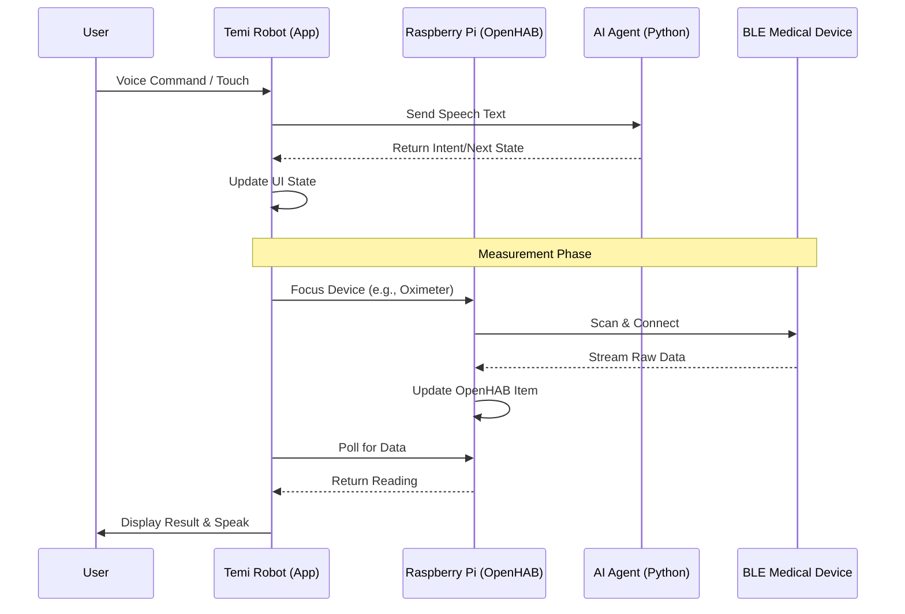

# HealthHub Android Application

## Overview

HealthHub is a comprehensive patient screening application designed for the Temi robot. It facilitates automated health assessments by integrating with various medical devices (Oximeter, Thermometer, Blood Pressure Monitor) and guiding patients through a conversational questionnaire. The application utilizes a state machine architecture to manage the flow of interactions and data collection.

## Features

- **Robotic Integration**: Runs on the Temi robot platform with navigation and voice interaction capabilities.
- **Medical Device Connectivity**:
  - Pulse Oximeter: BLE integration for real-time SpO2 and Pulse readings.
  - Thermometer: BLE integration for temperature monitoring.
  - Blood Pressure Monitor: Integration via OpenHAB backend.
- **Voice-Activated Interface**: Uses speech recognition and text-to-speech to provide a hands-free user experience.
- **Questionnaire System**: Collects patient lifestyle data (smoking, alcohol, exercise) via voice or touch based on NHS guidelines.
- **Data Management**: Stores session data locally and synchronizes with an OpenHAB backend for health records.

## Architecture

The system consists of three main components:
1.  **Android Application**: The frontend running on Temi, handling UI, voice, and flow logic.
2.  **Raspberry Pi Gateway**: Hosts OpenHAB and Python services to bridge BLE medical devices with the network.
3.  **LangGraph Agent**: Provides intelligent conversation logic for the questionnaire.

## Installation

### Prerequisites
- Temi Robot (Android 11+)
- Raspberry Pi (3 or 4) with Bluetooth support
- OpenHAB 3.x/4.x installed on the Pi

### Deployment
To build and deploy the application to the Temi robot:

```bash
./gradlew assembleDebug
./deploy_to_temi.sh
```

Ensure ADB is connected to the robot before deploying.

## Usage

1.  Launch the application on the Temi robot.
2.  The robot will greet the patient and provide instructions.
3.  Follow the on-screen and voice prompts to complete the health screening.
4.  Data is automatically saved upon completion.

## Project Structure

A detailed overview of the project's organization:

- `app/` - Main Android Application source code (Kotlin).
  - `src/main/java/org/hwu/care/healthub/` - Core application logic.
    - `core/` - State machine and session management.
    - `data/` - API clients and data models.
    - `ui/` - Jetpack Compose UI screens.
  - `src/main/res/` - Resources including layout XMLs and raw video assets.
- `langraph-backend/` - Python-based AI Agent using LangGraph.
  - `main.py` - FastAPI entry point for the agent.
  - `agent.py` - Core agent logic and prompt definitions.
- `*.service` - Systemd service files for Raspberry Pi deployments.
- `*_service.py` - Python scripts acting as listeners for BLE devices (Oximeter, Thermometer).
- `deploy_to_temi.sh` - Automated script to build and push the APK to the robot.

## System Architecture

The following diagram illustrates the sequential flow of data and interaction:



## Device Configuration & Credentials

### Hardware Inventory

| Device Role | Hardware Model | IP Address | MAC Address |
|---|---|---|---|
| **Robot** | Temi Robot Gen 2 | `192.168.2.115` | - |
| **Backend/Gateway** | Raspberry Pi 4 | `192.168.2.150` | - |
| **Oximeter** | Generic BLE Pulse Oximeter | - | `CB:31:33:32:1F:8F` |
| **Thermometer** | Beurer FT95 | - | `FF:00:00:00:37:8C` |
| **Blood Pressure** | Omron BP7000 | - | `F0:A1:62:ED:E6:A9` |

### System Credentials

**Raspberry Pi (SSH & OpenHAB Console)**
- **Username**: `openhabian`
- **Password**: `openhabian`

### Device Connection Setup

To bridge the BLE medical devices with OpenHAB, the Raspberry Pi uses Python scripts managed by systemd.

#### 1. Setup Python Environment
On the Raspberry Pi:
```bash
# Create directory and virtual environment
mkdir -p /home/openhabian/healthub-main
cd /home/openhabian/healthub-main
python3 -m venv venv
source venv/bin/activate

# Install dependencies
pip install bleak requests
```

#### 2. Deploy Scripts & Services
1.  Copy `oximeter_service.py` and `thermometer_service.py` to `/home/openhabian/`.
2.  Copy `oximeter.service` and `thermometer.service` to `/etc/systemd/system/`.

#### 3. Enable Services
```bash
sudo systemctl daemon-reload
sudo systemctl enable oximeter.service
sudo systemctl start oximeter.service
sudo systemctl enable thermometer.service
sudo systemctl start thermometer.service
```

#### 4. OpenHAB Integration
The scripts push data to OpenHAB Items via REST API. Ensure these items exist in your OpenHAB configuration:
*   `Oximeter_SpO2` (Number)
*   `Oximeter_Pulse` (Number)
*   `Thermometer_Temperature` (Number)
*   `Omron_Systolic` (Number)
*   `Omron_Diastolic` (Number)
