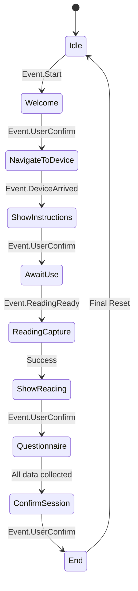

# HealthHub State Machine: Logic & Components

The State Machine is the "Conductor" of the app. It ensures that the robot follows a strict, safe, and logical sequence of events.

---

## 1. The States (Where we are)
A **State** represents a specific "moment" in the user journey.

| Component Name | Visual Context | Robot Behavior |
| :--- | :--- | :--- |
| **`State.Idle`** | Home Screen | Waiting for "Start" command. |
| **`State.Welcome`** | Animated Greeting | Robot introduces itself: "Hello, I am HealthHub." |
| **`State.NavigateToDevice`** | Map Progress | Robot is physically driving to a station (e.g., Oximeter). |
| **`State.ShowInstructions`** | Graphic/Tutorial | Robot explains: "Please place your finger in..." |
| **`State.AwaitUse`** | Waiting/Pulse | App is polling the Pi for live sensor data. |
| **`State.ReadingCapture`** | "Taking Reading..." | Data is being received and validated. |
| **`State.ShowReading`** | Large Data Display | Robot asks: "Your heart rate is 72. Is this correct?" |
| **`State.Questionnaire`** | Form/Progress | Transitioning into the interview-style questions. |
| **`State.ConfirmSession`** | Summary List | Review of all collected data before saving. |
| **`State.End`** | Thank You Screen | Robot returns to the charging dock. |

---

## 2. The Events (What happened)
An **Event** is a trigger that moves the system from one state to the next.

| Component Name | Source | Meaning |
| :--- | :--- | :--- |
| **`Event.Start`** | User (Voice/Tap) | User wants to begin the screening. |
| **`Event.UserConfirm`** | User (Voice/Tap) | User said "Yes", "Next", or tapped a button. |
| **`Event.DeviceArrived`** | Temi SDK | Robot has physically reached the navigation target. |
| **`Event.ReadingReady`** | Pi Backend | Sensors have detected a stable signal. |
| **`Event.Timeout`** | Internal Timer | 30 seconds of inactivity; return to home screen. |
| **`Event.Abort`** | System/User | Emergency stop or "Cancel" command. |

---

## 3. Transition Logic (How it flows)
This illustrates the "Next Mode" logic based on specific combinations.

---

## In-Depth Visualization

---

## Code Implementation
These components are strictly typed in Kotlin to prevent "Illegal State" errors (e.g., trying to take heart rate on the Home Screen).

*   **Logic File:** `app/src/main/java/org/hwu/care/healthub/core/StateMachine.kt`
*   **Definitions:** Uses `sealed class State` and `sealed class Event` for maximum safety.
